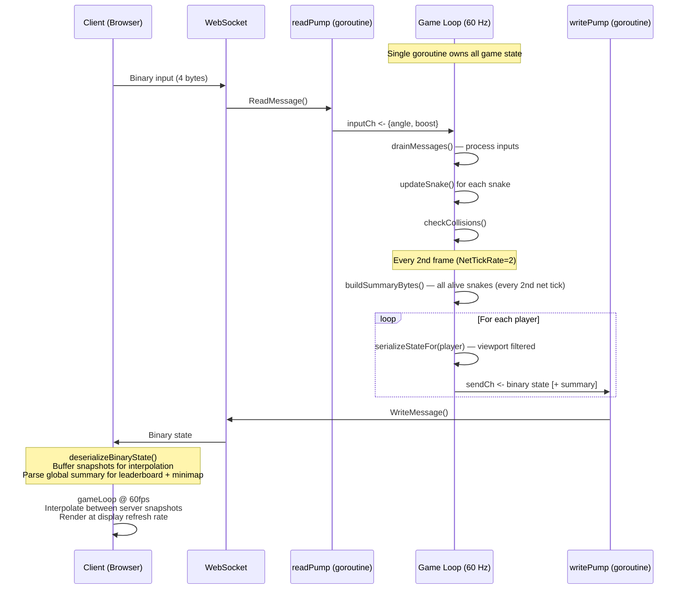

# Snake.io

A multiplayer snake game playable in the browser. Supports solo play with AI opponents and online multiplayer via a Go WebSocket server.

## Running the Server

```bash
cd server
go build -o snake-server .
./snake-server
```

Open http://localhost:8080 in your browser. The client HTML is embedded in the binary — no additional files needed.

### Server Flags

| Flag | Default | Description |
|------|---------|-------------|
| `-port` | `8080` | HTTP/WebSocket server port |

Example with custom port:

```bash
./snake-server -port 3000
```

## How to Play

- **Solo Play** - Click "Solo Play" on the start screen. Plays locally with AI snakes.
- **Online Play** - Click "Online Play", enter the server WebSocket URL (e.g. `ws://localhost:8080/ws`), and click Connect.

### Controls

**Desktop:** Move the mouse to steer, hold left click or Space to boost.

**Mobile:** Touch and drag to steer with the virtual joystick, tap the boost button to boost.

## Project Structure

```
server/
  main.go           Entry point, HTTP server, embedded client
  game.go           Game logic (snakes, AI, food, collisions)
  network.go        WebSocket handling, binary protocol serialization
  index.html        Client (game rendering, input, networking) — embedded via go:embed
  go.mod            Go module definition
```

## Architecture

### Connection Flow

Each player has a dedicated WebSocket connection. The server sends **per-player** state messages (viewport-filtered snake data + global summary) — there is no shared broadcast buffer.

```mermaid
sequenceDiagram
    participant A as Player A (Browser)
    participant B as Player B (Mobile)
    participant C as Player C (Mobile)
    participant S as Server (Go)

    Note over S: Game loop running at 60 Hz<br/>30 AI snakes + food spawned

    A->>S: WebSocket connect /ws
    S->>A: welcome JSON {pid, worldSize}
    A->>S: join JSON {name}
    S->>A: Full state (binary, includes food)

    B->>S: WebSocket connect /ws
    S->>B: welcome JSON {pid, worldSize}
    B->>S: join JSON {name}
    S->>B: Full state (binary, includes food)

    C->>S: WebSocket connect /ws
    S->>C: welcome JSON {pid, worldSize}
    C->>S: join JSON {name}
    S->>C: Full state (binary, includes food)

    Note over S: Every 2 frames (30 Hz net tick)

    rect rgb(40, 40, 80)
        Note over S: serializeStateFor() per player<br/>Viewport-filtered snakes<br/>+ global summary every 2nd net tick (15 Hz)
        par Per-player state
            S->>A: Binary state (A's viewport)
            S->>B: Binary state (B's viewport)
            S->>C: Binary state (C's viewport)
        end
    end

    par Player inputs (continuous)
        A->>S: Binary input (angle + boost) 4 bytes
        B->>S: Binary input (angle + boost) 4 bytes
        C->>S: Binary input (angle + boost) 4 bytes
    end

    Note over S: Every 9th net tick: food data included
```



### Data Flow Detail



### Binary Protocol

Each state message contains:

| Section | Content | Scope |
|---------|---------|-------|
| Header | type=1, flags, snakeCount | - |
| Snakes | Per-snake: position, every 3rd segment, score, metadata | Viewport-filtered (nearby only) |
| Food | Position, color, radius, value | Viewport-filtered (1200u radius), every 9th net tick |
| Summary | Head position, score, name, color per alive snake | **Global** (all snakes), every 2nd net tick |

Client input is a fixed 4-byte binary message: `type(1) + angle_int16(2) + boost(1)`.

### Bandwidth

Per-client outbound bandwidth is ~38 KB/s, broken down roughly as:

| Component | KB/s | Frequency |
|-----------|------|-----------|
| Snakes (viewport) | ~27 | 30 Hz |
| Food (viewport) | ~4 | 3.3 Hz |
| Summary (global) | ~7 | 15 Hz |

## Requirements

- Go 1.21+
- A modern browser with WebSocket support
