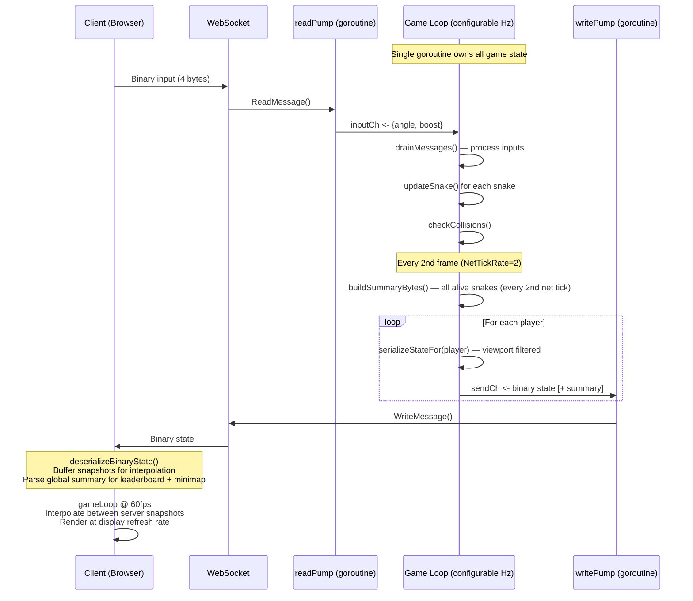

# Schlangen.TV

A multiplayer snake game playable in the browser and on Apple TV. Supports solo play with AI opponents and online multiplayer via a Go WebSocket server.

## Running the Server

```bash
cd server
go build -o snake-server .
./snake-server
```

Open http://localhost:8080 in your browser. The client HTML is embedded in the binary — no additional files needed.

### Server Flags

| Flag | Default | Description |
|------|---------|-------------|
| `-port` | `8080` | HTTP/WebSocket server port |
| `-config` | | Path to JSON config file |
| `-world-size` | `10000` | World size |
| `-food-count` | `3000` | Food item count |
| `-ai-count` | `30` | AI snake count |
| `-base-speed` | `3.2` | Base snake speed |
| `-boost-speed` | `5.5` | Boost speed |
| `-turn-speed` | `0.08` | Turn speed |
| `-max-boost` | `100` | Max boost meter |
| `-boost-drain` | `0.6` | Boost drain rate |
| `-boost-regen` | `0.15` | Boost regen rate |
| `-base-snake-len` | `10` | Base snake length |
| `-kill-food-count` | `8` | Food dropped on kill |
| `-boundary-margin` | `50` | Boundary margin |
| `-ai-respawn-ticks` | `180` | AI respawn delay in ticks |

The `tickRate` parameter (default `60`) is configurable via the JSON config file but has no CLI flag.

Examples:

```bash
./snake-server -port 3000
./snake-server -world-size 5000 -ai-count 10
./snake-server -config rules.json
```

### Config File

You can use a JSON file to set all gameplay parameters at once. CLI flags override values from the config file.

```json
{
  "worldSize": 5000,
  "foodCount": 1500,
  "aiCount": 10,
  "baseSpeed": 4.0,
  "boostSpeed": 6.5,
  "turnSpeed": 0.08,
  "maxBoost": 100,
  "boostDrain": 0.6,
  "boostRegen": 0.15,
  "baseSnakeLen": 10,
  "killFoodCount": 8,
  "boundaryMargin": 50,
  "aiRespawnTicks": 180,
  "tickRate": 60
}
```

Only include the fields you want to change — omitted fields keep their defaults.

## How to Play

- **Solo Play** - Click "Solo Play" on the start screen. Plays locally with AI snakes.
- **Online Play** - Click "Online Play", enter the server WebSocket URL (e.g. `ws://localhost:8080/ws`), and click Connect.

### Controls

**Desktop:** Move the mouse to steer, hold left click or Space to boost.

**Mobile:** Touch and drag to steer with the virtual joystick, tap the boost button to boost.

## Project Structure

```
engine/
  game.go           Game logic (snakes, AI, food, collisions, spatial grid)
  network.go        WebSocket handling, binary protocol serialization, dashboard
  server.go         HTTP server, embedded client
  index.html        Client (game rendering, input, networking) — embedded via go:embed
server/
  main.go           CLI entry point, flag parsing
mobile/
  mobile.go         gomobile bindings for embedding the server in iOS/tvOS/Android
appletv/
  SnakeTV/
    Sources/
      SnakeTVApp.swift       App entry point
      ContentView.swift      Main UI (QR code, stats dashboard, leaderboard)
      HouseRulesView.swift   Game settings ("House Rules") with presets
      ServerManager.swift    Manages embedded Go server lifecycle + stats polling
      QRCodeView.swift       QR code generator for connect URL
    Assets.xcassets/         App icons, Top Shelf images, brand assets
    project.yml              XcodeGen project definition
build.sh                     gomobile build + platform patching script
```

## Architecture

### Connection Flow

Each player has a dedicated WebSocket connection. The server sends **per-player** state messages (viewport-filtered snake data + global summary) — there is no shared broadcast buffer.

```mermaid
sequenceDiagram
    participant A as Player A (Browser)
    participant B as Player B (Mobile)
    participant C as Player C (Mobile)
    participant S as Server (Go)

    Note over S: Game loop running at configurable tick rate<br/>(60 Hz default, 30 Hz on Apple TV)<br/>AI snakes + food spawned

    A->>S: WebSocket connect /ws
    S->>A: welcome JSON {pid, worldSize}
    A->>S: join JSON {name}
    S->>A: Full state (binary, includes food)

    B->>S: WebSocket connect /ws
    S->>B: welcome JSON {pid, worldSize}
    B->>S: join JSON {name}
    S->>B: Full state (binary, includes food)

    C->>S: WebSocket connect /ws
    S->>C: welcome JSON {pid, worldSize}
    C->>S: join JSON {name}
    S->>C: Full state (binary, includes food)

    Note over S: Every 2 frames (30 Hz net tick)

    rect rgb(40, 40, 80)
        Note over S: serializeStateFor() per player<br/>Viewport-filtered snakes<br/>+ global summary every 2nd net tick (15 Hz)
        par Per-player state
            S->>A: Binary state (A's viewport)
            S->>B: Binary state (B's viewport)
            S->>C: Binary state (C's viewport)
        end
    end

    par Player inputs (continuous)
        A->>S: Binary input (angle + boost) 4 bytes
        B->>S: Binary input (angle + boost) 4 bytes
        C->>S: Binary input (angle + boost) 4 bytes
    end

    Note over S: Every 9th net tick: food data included
```



### Data Flow Detail



### Binary Protocol

Each state message contains:

| Section | Content | Scope |
|---------|---------|-------|
| Header | type=1, flags, snakeCount | - |
| Snakes | Per-snake: position, every 3rd segment, score, metadata | Viewport-filtered (nearby only) |
| Food | Position, color, radius, value | Viewport-filtered (1200u radius), every 9th net tick |
| Summary | Head position, score, name, color per alive snake | **Global** (all snakes), every 2nd net tick |

Client input is a fixed 4-byte binary message: `type(1) + angle_int16(2) + boost(1)`.

### Bandwidth

Per-client outbound bandwidth is ~38 KB/s, broken down roughly as:

| Component | KB/s | Frequency |
|-----------|------|-----------|
| Snakes (viewport) | ~27 | 30 Hz |
| Food (viewport) | ~4 | 3.3 Hz |
| Summary (global) | ~7 | 15 Hz |

## Apple TV App

The `appletv/SnakeTV` directory contains a native tvOS app that embeds the Go game server via gomobile. Players connect from their phones by scanning a QR code displayed on the TV.

### Building

```bash
# Build the gomobile framework for tvOS
./build.sh

# Generate the Xcode project (requires xcodegen)
cd appletv/SnakeTV
xcodegen generate
open SnakeTV.xcodeproj
```

### tvOS Defaults

The Apple TV app uses lower defaults optimized for the A8 chip (Apple TV 4th gen):

| Parameter | Server Default | tvOS Default |
|-----------|---------------|--------------|
| World Size | 10000 | 5000 |
| Food Count | 3000 | 1500 |
| AI Count | 30 | 10 |
| Tick Rate | 60 Hz | 30 Hz |

All parameters are adjustable via the "House Rules" screen before starting a game.

## Engine Optimizations

The game engine includes several optimizations targeting low-power hardware (Apple TV 4th gen, A8 chip, 2 GB RAM):

### Ring Buffer Segments (`SegmentRing`)

Snake segments use a circular buffer instead of a Go slice. Moving a snake forward previously required `append([]Vec2{newHead}, segments...)` — an O(n) copy every frame per snake. With 30+ snakes at 60 Hz, that's ~1800 allocations/sec. The ring buffer (`Prepend` + `TrimTo`) is O(1) with no allocations during normal gameplay.

### Spatial Hash Grid for Food

Food items are indexed in a 200-unit cell grid (`foodGrid`). Food collision checks and AI food-seeking query only the nearby cells instead of iterating all food items. This reduces food lookups from O(snakes * food) to O(snakes * nearby_cells).

### Squared Distance Comparisons

All distance checks in AI logic (food seeking, hunting, collision avoidance, encirclement detection) use `distSq()` instead of `dist()`, avoiding `math.Sqrt` in hot paths. With 50 AI snakes, this eliminates tens of thousands of sqrt calls per second.

### Halved AI Update Rate

AI brains run every other frame (`g.frame%2 == 0`), halving the CPU cost of AI logic while remaining visually smooth since movement still updates every frame.

### Configurable Tick Rate

The game loop tick rate is configurable via `tickRate` in the JSON config. The tvOS app defaults to 30 Hz instead of 60 Hz, halving per-frame CPU budget requirements.

## Requirements

- Go 1.21+
- A modern browser with WebSocket support
- For Apple TV: Xcode 15+, gomobile, XcodeGen
